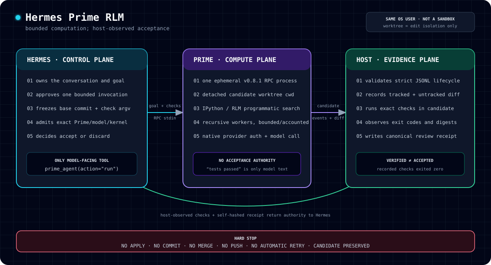

# Hermes Prime RLM

**Fix bugs in repositories whose evidence is too large for any context window.**

A standalone [Hermes Agent](https://github.com/NousResearch/hermes-agent) plugin
that runs a bounded coding goal through **Prime Agent** (a Recursive Language
Model agent) inside a detached Git worktree, then records **host-observed
checks** in an unsigned review receipt.

> **Hermes owns the goal, approvals, candidate, and verifier. Prime owns the
> bounded RPC computation.** v0.2 is deliberately one-shot; it does not make
> Prime the active Hermes agent or expose persistent sessions.

> Hermes Prime RLM is an independent community integration. It is not an
> official Nous Research or Prime Intellect product.



## One real Codex run — proof before pitch

On 2026-08-28, one non-retried canary ran through the actual
`prime_agent(action="run")` surface using Prime Agent v0.8.1 and the user's
Prime-native ChatGPT subscription:

```text
provider/model       openai-codex / gpt-5.6-sol
candidate            detached Git worktree
Prime lifecycle      agent_start → 1,472 events → agent_end → exit 0
Hermes-hosted check  import-check: passed, exit 0, 94 ms
result               VERIFIED
automatic retry      false
active checkout      unchanged
receipt SHA-256      060cf00edf63cafb4b233b7120e8f9901118562b32c919fccfd46ca4f6739380
```

Prime added `farewell(name)`, documented it, and wrote tests in the detached
candidate. Hermes independently ran the recorded import check; Prime's own
claim that its tests passed had no authority. Nothing was applied, committed,
or pushed. The receipt still says `UNSIGNED`, `UNQUIESCED`, and
`acceptance_status: PENDING`—`VERIFIED` means only that the recorded host check
exited zero. See [`docs/codex-canary.md`](docs/codex-canary.md) for the exact
evidence projection and limitations.

## The problem

At 3 AM a payments service starts failing. The evidence is a 5 MB log —
1.5M tokens, roughly 5× beyond any frontier model's context window. A coding
agent has two bad options:

- **Sample it and guess.** The model reads the first few hundred lines,
  hallucinates the log format, and ships a "fix" that was never tested against
  the real data.
- **Drown in context.** Even if the log fit, [context rot](https://research.trychroma.com/context-rot) degrades reasoning as irrelevant tokens pile up.

Recursive Language Models ([Zhang, Kraska & Khattab, MIT CSAIL](https://arxiv.org/abs/2512.24601))
give a third option: treat the huge input as *an external environment* the
model interacts with programmatically — peeking, chunking, and recursing over
it with code instead of attention. RLMs handle inputs up to **two orders of
magnitude beyond the context window** while outperforming base models by up to
2× at comparable cost. The same pattern powers real tools like
[Droste](https://github.com/tensor-systems/droste) and
[LangChain Deep Agents](https://www.langchain.com/blog/how-to-use-rlms-in-deep-agents)
for analytics over massive corpora; practitioners use it daily for log
forensics, Kubernetes state dumps, and incident timelines.

**But an RLM that says "fixed it!" is still just a model saying words.**
Hermes Prime RLM runs recorded checks after the agent exits and preserves the
candidate and evidence for review. A passing check is useful local evidence;
it is not proof of semantic correctness or adversarially independent custody.

## The demo: `examples/payments-api`

`error_rate()` must return the fraction of log **entries** that are ERROR
level. The catch: 24,600 stack-trace continuation lines are interleaved with
60,000 real entries, and DEBUG lines look like entries but aren't part of the
reference population. The naive implementation (counting every physical line)
is what's committed — and it fails:

```
$ cd examples/payments-api && python run_tests.py
error_rate -> 0.096927, expected 0.174672
AssertionError: FAIL: 0.09692671394799054 != 0.174672
```

The fixture is generated by [`scripts/generate_fixture.py`](scripts/generate_fixture.py)
and checked in (~5 MB). Point the tool at it:

```json
{
  "action": "run",
  "goal": "error_rate() in app.py fails run_tests.py. events.log is ~1.5M tokens — do NOT read it into memory or print it; stream it programmatically. Make run_tests.py print PASS.",
  "repository_path": "<repo>/examples/payments-api",
  "checks": [
    { "name": "oracle", "argv": ["python", "run_tests.py"], "timeout_seconds": 120 }
  ],
  "runtime_timeout_seconds": 1200
}
```

What comes back on a successful run:

```json
{
  "ok": true,
  "status": "VERIFIED",
  "run_id": "ef0778f4-0516-4550-8fa4-9296db97e8da",
  "candidate_path": ".../runs/ef0778f4.../candidate",
  "receipt_sha256": "2206d3528bb336b8...",
  "checks": [{ "name": "oracle", "status": "passed", "exit_code": 0 }]
}
```

`VERIFIED` is a convenience label meaning that the recorded commands were
executed by the host inside the candidate and exited `0`. The receipt separately
records that the checks may be `MODEL_PROPOSED`, the candidate is `UNQUIESCED`,
artifact integrity is `RECORDED_NOT_REVALIDATED`, authenticity is `UNSIGNED`,
and acceptance remains `PENDING`. In live runs on this fixture,
the agent correctly discovered from the data alone that DEBUG lines are excluded
from the entry population (8200 / 46945 = 0.174672 exactly), documented its
reasoning, added unit tests — and never once loaded the full file into memory.

## What the plugin does

`prime_agent(action="run")` takes a goal, a clean Git repository, and explicit verification
commands, then:

1. Freezes the repository's exact current commit.
2. Creates a **detached candidate worktree** from that commit.
3. Starts one ephemeral Prime Agent v0.8.1 RPC session with both native process
   `cwd` and fixed `--cwd` bound to the candidate. The bounded task envelope is
   delivered through RPC stdin and never appears in process argv.
4. Stages and awaits a correlated state handshake, disabled Prime auto-retry,
   available active model, and accepted prompt before work can proceed; then
   requires the first tool to successfully execute an exact IPython `import rlm`
   health probe, one `agent_start`, one `agent_end`, session statistics,
   and a final non-streaming state.
5. Runs the recorded verification commands inside the candidate and observes
   their exit status.
6. Writes a canonically encoded, self-hashed, unsigned receipt containing
   recorded artifact digests and a SHA-256 command identity. Raw operator
   command arguments are never persisted because they may contain credentials;
   the receipt keeps only hashes and allowlisted executable/script basenames,
   then returns a compact result.

The plugin never applies, commits, merges, pushes, retries, or deletes the
candidate. It checks the active checkout before and after the run, but Prime
shares the user's OS authority and is not prevented from reaching that checkout.
Acceptance is always a human or downstream policy decision.

## Trust boundaries

Responsibilities are separated in code, but not by OS privilege:

- **Hermes** owns the conversation, the decision to invoke the tool, and the
  final accept/discard decision.
- **Prime Agent** owns its RLM trajectory, IPython environment, recursive
  subagents, and native provider authentication. An operator may freeze an
  exact available model in the digest-bound runtime plan; the plugin never
  auto-routes or extracts provider credentials.
- **The plugin** performs admission, worktree creation, protocol validation,
  host-observed checks, evidence collection, and receipt writing.

Prime and the plugin run as the same user. A malicious or compromised worker
may be able to alter source, candidate, or evidence, and an unsigned receipt
self-hash does not establish provenance.

Prime's textual claims have **no verification authority**. "All tests passed"
is not a host-observed check result. See
[`docs/trust-boundaries.md`](docs/trust-boundaries.md) for the full design,
including why ambiguous runs degrade to `UNCERTAIN` instead of guessing.

### Status semantics

| Status | Meaning |
|---|---|
| `VERIFIED` | Prime exited cleanly with a valid stream and every supplied recorded host check exited `0`. Check authority, quiescence, integrity, authenticity, and acceptance remain separate fields. |
| `COMPLETED_UNVERIFIED` | Prime finished but **no checks were supplied**. Never treated as success. |
| `FAILED_VERIFICATION` | Prime finished but a check failed, timed out, or could not launch. |
| `FAILED` | Known failure. Candidate preserved; may contain partial changes. |
| `UNCERTAIN` | No reliable terminal boundary (timeout, malformed/incomplete stream, duplicate lifecycle events). No checks run, candidate preserved, `automatic_retry_allowed` is always `false`. |

### No-replay behavior

One invocation = one Prime process. There is no automatic retry, ever. If a run
ends `UNCERTAIN`, inspect the preserved candidate and evidence and start a new
run explicitly if you choose to.

## Installation

Requires Python ≥ 3.11, Git, and **Prime Agent v0.8.1 exactly**. The installed
version is probed before candidate creation; anything else is refused because
the RPC event and command contract is pinned to that release.

Install the standalone plugin through Hermes (disabled until you consent to
enable it):

```bash
hermes plugins install NobleSpartan6/hermes-prime-rlm
```

Install a release wheel into the same Python environment that runs Hermes; the
`hermes_agent.plugins` entry point is discovered on the next startup:

```bash
python -m pip install hermes_prime_rlm-0.2.0-py3-none-any.whl
```

For source development, clone this repository and link it into your Hermes user
plugin directory (Windows shown; on macOS use a symlink):

```powershell
New-Item -ItemType Junction -Path "$env:LOCALAPPDATA\hermes\plugins\prime-rlm" -Target "<repo-path>"
```

Enable and verify:

```bash
hermes plugins enable prime-rlm
hermes plugins list
```

Start a **new** Hermes session (tool schemas load at session start) and ask it
to fix a repository — Hermes will call `prime_agent(action="run")` natively.

Run the operator-only readiness check and zero-YAML setup transaction:

```bash
hermes prime doctor --json       # strictly read-only
hermes prime setup               # default-negative, digest-bound config repair
hermes prime setup --check       # read-only alias
```

`hermes prime setup` currently adopts an existing exact Prime v0.8.1 runtime,
removes a stale operator `--model` override only after proving Prime's native
selection, discovers and proves a profile-scoped kernel interpreter, and
atomically writes one `prime_runtime` object through `ctx.set_config`. It never
edits YAML directly. `hermes prime doctor --fix` delegates to the same engine;
`/prime-setup` remains read-only and points operators to the local terminal.

The packaged `runtime_lock.json` pins the four Prime v0.8.1 release tarballs,
but a dependency-complete Node/uv/Bash/npm closure is not yet shipped. On a
machine without an adoptable exact runtime, setup fails closed rather than
performing a mutable or global install. Do not describe the current runtime as
`MANAGED_LOCKED` until that closure and cross-platform acquisition tests exist.

Prime uses its own native credential store. The plugin does not copy Hermes
provider credentials into Prime, and default RPC launches do not inherit
ambient provider variables such as `OPENAI_API_KEY`, `PRIME_API_KEY`, or AWS
secret keys. Non-secret OS/runtime paths are allowlisted so Prime can find its
native config and an explicitly configured `PRIME_AGENT_KERNEL_PYTHON`.
On Windows, setup stores the absolute kernel interpreter in the non-secret
`prime_runtime.kernel_python` field because Prime v0.8.1's automatic bootstrap
uses the POSIX `bin/python` path.

## Platform support

- **Windows 10/11 native** — first-class. `.cmd`/`.bat` shims go through an
  injection-hardened cmd.exe adapter (space-bearing paths via 8.3 short names;
  cmd metacharacters refused before spawn). Tree termination via
  `taskkill /PID <pid> /T /F`. Plugin-owned processes use `CREATE_NO_WINDOW`;
  the showcase recorder opens a console only with explicit `--visible-console`.
- **macOS native** — `start_new_session=True`; timeout escalates
  SIGTERM→SIGKILL against the owned process group.
- **Linux native** — required CI acceptance target alongside Windows and macOS.

## Run layout & receipt

```
<hermes home>/plugin-data/prime-rlm/runs/<run-id>/
├── request.json          # canonical request envelope (sha256 in receipt)
├── prime-task.md         # goal + fixed host rules (goal never on a CLI)
├── candidate/            # detached worktree — preserved after every outcome
├── prime-events.jsonl    # bounded Prime stdout used for protocol validation
├── prime-stderr.log     # empty sentinel; RPC stderr is suppressed to DEVNULL
├── tracked.patch         # git diff --binary --full-index vs base
├── status.txt
├── checks/<name>/stdout.log, stderr.log
└── receipt.json          # {"receipt": {...}, "receipt_sha256": "..."}
```

Inspecting a candidate:

```bash
cd "<candidate-path>"                       # ordinary registered worktree
git -C <source-repo> worktree remove <candidate-path>   # manual cleanup only
```

Nothing is removed automatically.

Setup transactions are separate from candidate runs:

```text
<plugin-data>/setup-transactions/<transaction-id>/
├── journal.json
└── receipt.json
```

The self-hashed setup receipt binds the plan digest, effective command digest,
zero-model accounting, and the L0–L3 state-ownership manifest. `READY` means
local no-model admission passed; it does not mean provider inference or release
readiness has passed. `NOT_READY`, `UNCERTAIN`, and `UNCERTAIN_SETUP` remain
distinct machine states, all with automatic retry disabled.

Prime RPC stdout, the version probe, Git status output, and tracked patches use
bounded drains. RPC stderr is suppressed rather than piped because descendants
may inherit stderr and hold a reader indefinitely; structured RPC failures stay
on stdout. Candidate-tree content is hashed as a stream. Bound overruns fail
closed.

## Non-goals (bounded v0.2 RPC tracer bullet)

Prime Continuim integration, persistent sessions, daemon adoption, resume,
refinement, auto-routing, desktop/dashboard UI, MCP, remote hosts, automatic
model selection/provider routing, retries,
auto-apply/commit/push, submodules, Docker, WSL.

## Tests

```bash
python -m pytest -q          # deterministic; never calls a live model
ruff check .
```

CI runs the suite natively on `windows-latest`, `macos-latest`, and
`ubuntu-latest` (Python 3.11 and 3.12), runs Plugin Doctor, and clean-installs the built wheel using only a
deterministic fake Prime executable.

## Security warning

This plugin is not a sandbox. Prime Agent executes model-generated code with
the current user's permissions. A detached Git worktree protects the active
checkout from ordinary edits, but does not contain process access, filesystem
access, network access, credentials, malicious code, or independently
daemonized descendants.

## Privacy warning

Do not use the plugin on repositories containing secrets or confidential
material unless the configured Prime Agent model and provider are approved for
that data.

“Use the same provider” means compatible provider/model identity plus Prime's
own login state. It does not mean extracting or copying a Hermes credential.

## Troubleshooting

- **Version mismatch** — `UNSUPPORTED_PRIME_VERSION`: your prime-agent is not
  exactly `0.8.1`; `UNPARSEABLE_PRIME_VERSION`: `--version` output
  couldn't be parsed (check wrappers printing extra text).
- **PATH problems** — the first command token must resolve absolutely or via
  `shutil.which`; check with `where prime-agent` / `which prime-agent`.
- **Spaces in Windows paths** — fully supported on the direct route; the
  `.cmd` shim route uses 8.3 short paths (verify with
  `fsutil 8dot3name query C:`).
